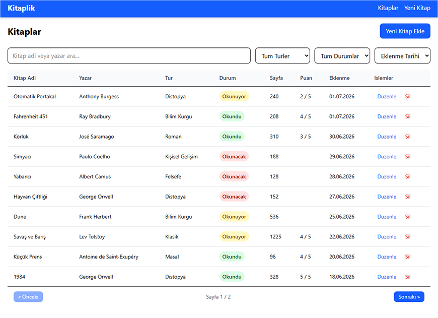
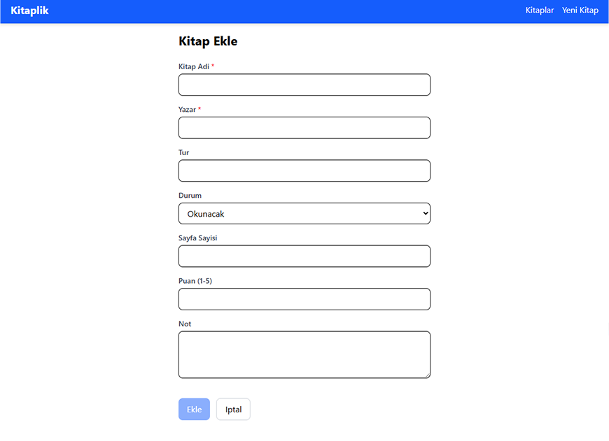
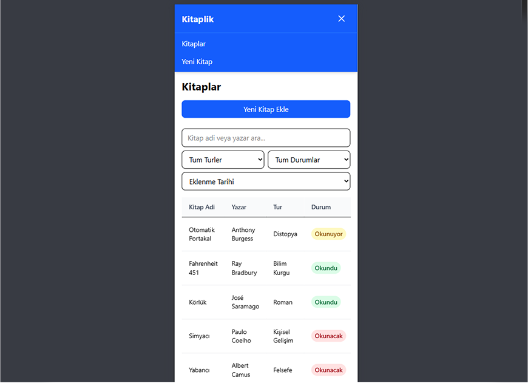

# Kitaplik ve Okuma Listesi

Angular + localStorage tabanlı kişisel kütüphane uygulaması. Kullanıcı okuduğu, okuyacağı ve okumakta olduğu kitapları takip edebilir; ekleme, düzenleme, silme işlemleri yapabilir; tür ve duruma göre filtreleyip arama yapabilir.

## Kurulum

```bash
npm install
ng serve
```

Tarayıcıda `http://localhost:4200` adresini açın.

## Proje Amacı

Kullanıcının okuduğu, okuyacağı ve okumakta olduğu kitapları takip edebileceği bir kişisel kütüphane uygulamasıdır. CRUD işlemleri (Ekleme, Listeleme, Düzenleme, Silme) eksiksiz olarak çalışır. Veriler tarayıcının localStorage alanında saklanır.

## Veri Modeli

`src/app/features/books/models/book.model.ts`

| Alan          | Tip                                |
|---------------|------------------------------------|
| id            | number                             |
| ad            | string                             |
| yazar         | string                             |
| tur           | string                             |
| durum         | 'okunacak' / 'okunuyor' / 'okundu' |
| sayfaSayisi   | number                             |
| puan          | number (1-5)                       |
| not           | string                             |
| eklenmeTarihi | string (ISO)                       |

## Sayfalar ve Rotalar

- **Kitap Listesi** — `/kitaplar` — Tüm kitapların listelendiği, filtre, arama ve sıralamanın bulunduğu ekran.
- **Kitap Ekleme** — `/kitaplar/ekle` — Yeni kitap eklemek için reactive form sayfası.
- **Kitap Düzenleme** — `/kitaplar/:id/duzenle` — Mevcut kitabı güncellemek için reactive form sayfası.

## Ekran Görüntüleri

### Kitap Listesi


### Kitap Ekleme


### Mobil Görünüm


## Mimari

Proje feature-based mimari ile kurgulanmıştır. localStorage erişimi yalnızca `core/services/storage.service.ts` üzerinden yapılır.

```
src/app/
  core/
    services/
      storage.service.ts
      notification.service.ts
    guards/
      unsaved-changes.guard.ts
    models/
      table-column.model.ts
      confirm-dialog-data.model.ts
      notification.model.ts
  shared/
    components/
      data-table/
      confirm-dialog/
      form-field/
      empty-state/
      loading-spinner/
      toast/
    pipes/
      status-text.pipe.ts
    directives/
      status-color.directive.ts
    validators/
      score-validator.ts
  features/books/
    pages/
      books-list/
      books-form/
    services/
      books.service.ts
    models/
      book.model.ts
    books.routes.ts
  app.ts
  app.html
  app.config.ts
  app.routes.ts
```

## Teknolojiler

- **Angular 22** — Standalone component, Signals API, Reactive Forms
- **RxJS** — BehaviorSubject ile servis katmanı
- **Tailwind CSS** — Responsive arayüz
- **localStorage** — Veri saklama (yalnızca StorageService üzerinden)
- **Lazy Loading** — Feature sayfaları loadComponent/loadChildren ile yüklenir

## Custom Elements

### StatusTextPipe
`src/app/shared/pipes/status-text.pipe.ts` — 'okundu' değerini 'Okundu' olarak gösterir. DataTable badge column tipinde kullanılır.

### StatusColorDirective
`src/app/shared/directives/status-color.directive.ts` — Duruma göre kırmızı/sarı/yeşil rozet rengi ekler. DataTable badge column tipinde kullanılır.

### scoreValidator
`src/app/shared/validators/score-validator.ts` — Puan alanının 1-5 arası tam sayı olduğunu kontrol eder. BooksForm sayfasında kullanılır.

### UnsavedChangesGuard
`src/app/core/guards/unsaved-changes.guard.ts` — Form sayfasından kaydetmeden çıkarken uyarı gösterir. `/kitaplar/ekle` ve `/kitaplar/:id/duzenle` rotalarında kullanılır.
